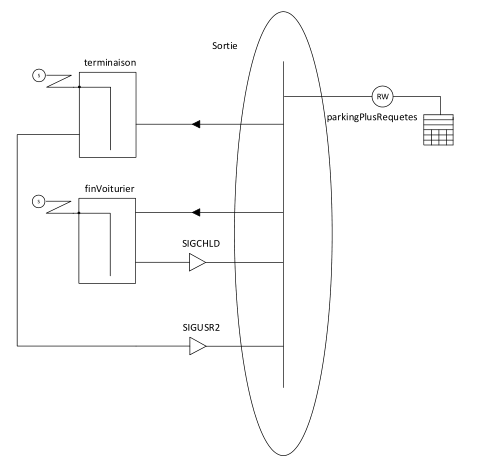

LACATRE stencil for Visual Studio
=============

##What is LACATRE ?

Here's a quote from the [FAQ of the LA4-Project](http://la4.berlios.de/faq.html) : 
> LACATRE stands for (in french) "Langage d'aide à la conception de systèmes temps réel", i.e., language facilitating the conception of real-time systems. In fact, this formalism has an educational purpose. It is in consequence very intuitive. Tasks, mailboxes, semaphores, ... have a graphical representation. Active objects such as task have an execution bar. When you attach connectors to this bar, you specify the behavior of the object. The connector is on the other side connected to the object to which the action applies. This action can be create, destroy, take (semaphore), send (mailbox), ...

##What graphic representations can I use ?

As you can see bellow, we implemented the most used shapes of the language.
If you need a new one, feel free to fill a pull request.

##How do I use the stencil ?

Just open it in Visual Studio, create a new Empty Document and you're set.

##Example

